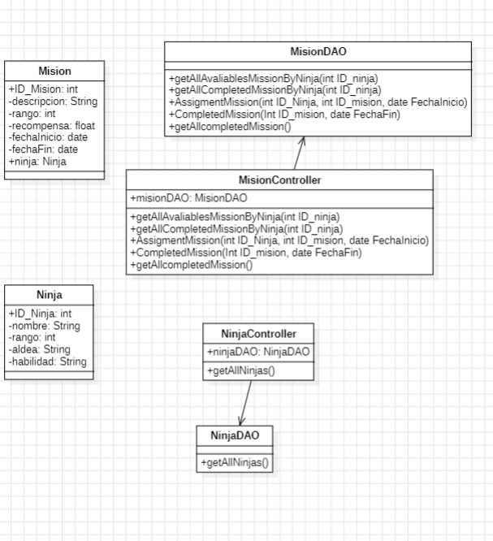
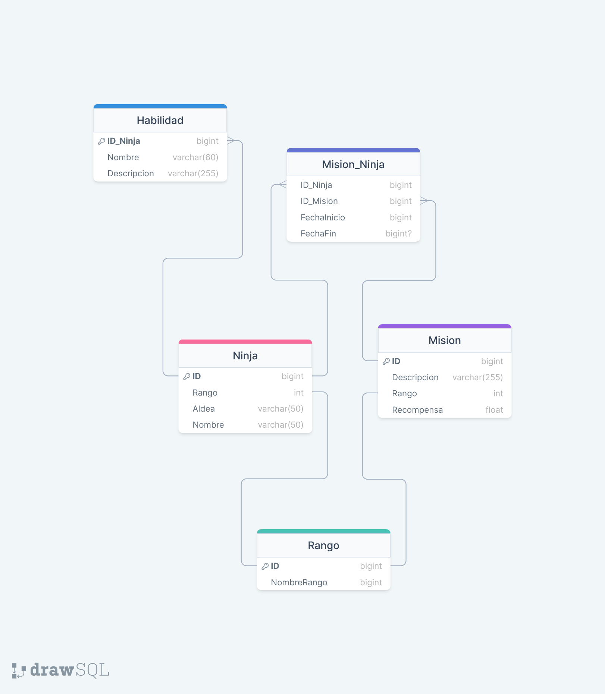

# PROYECTO FINAL JAVA

## Funcionalidades aplicacion

- Listar todos los ninjas junto con sus habilidades
- Mostrar las misiones disponibles para un ninja especifico
- Mostrar las misiones completadas para un ninja en especifico
- Asignar una mision a un ninja, registrando la fecha de inicio
-  marcar una mision como completad, registrando la fecha de finalizacion
- Mostrar todas las misiones completadas (Esta funcionalidad debe hacerse con archivos de texto, debe guardar el archivo de texto todas las misiones completadas y debe haber una funcionalidad en el programa que lea ese archivo de texto y muestre las misiones)

## Diagrama de clases

## Diagrama entidad relacion 
